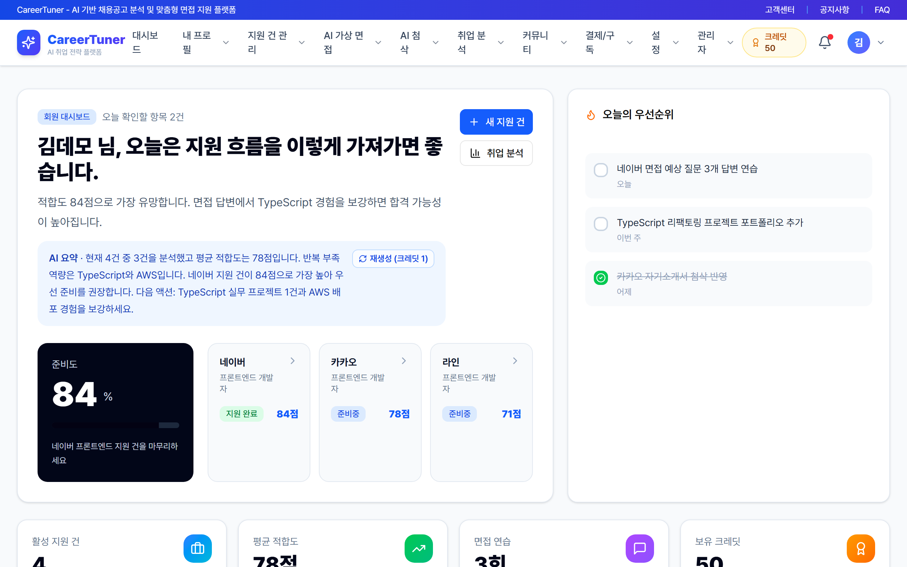
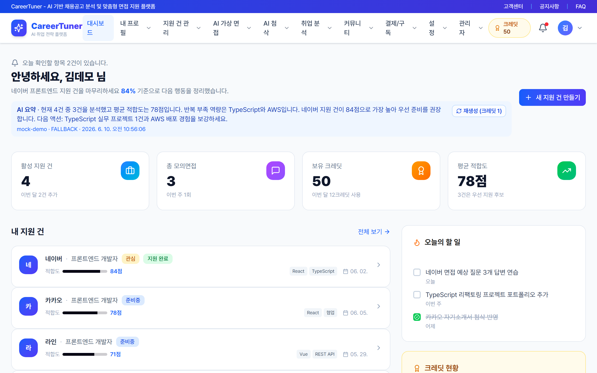
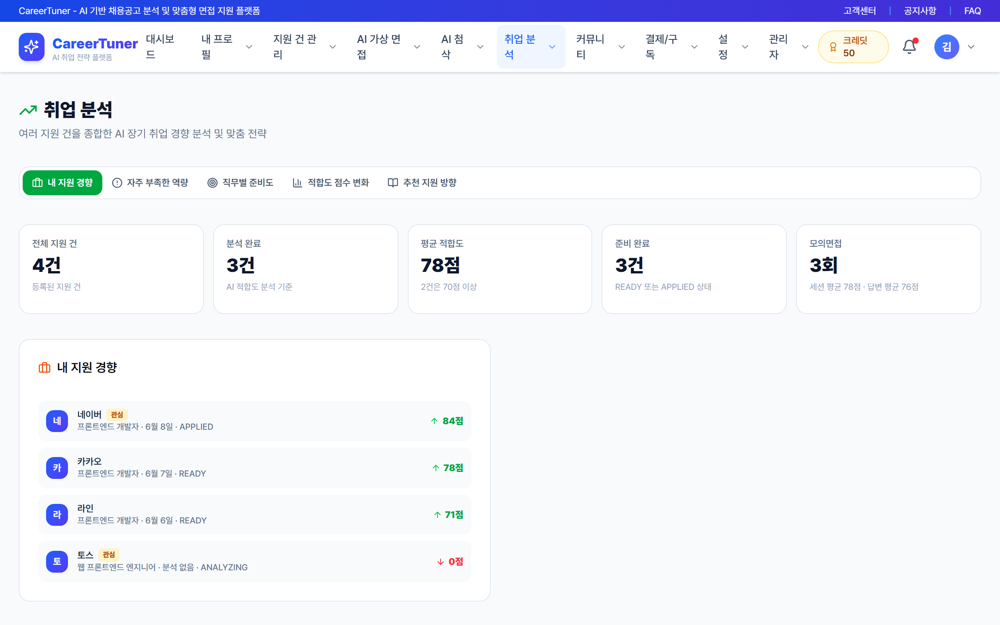
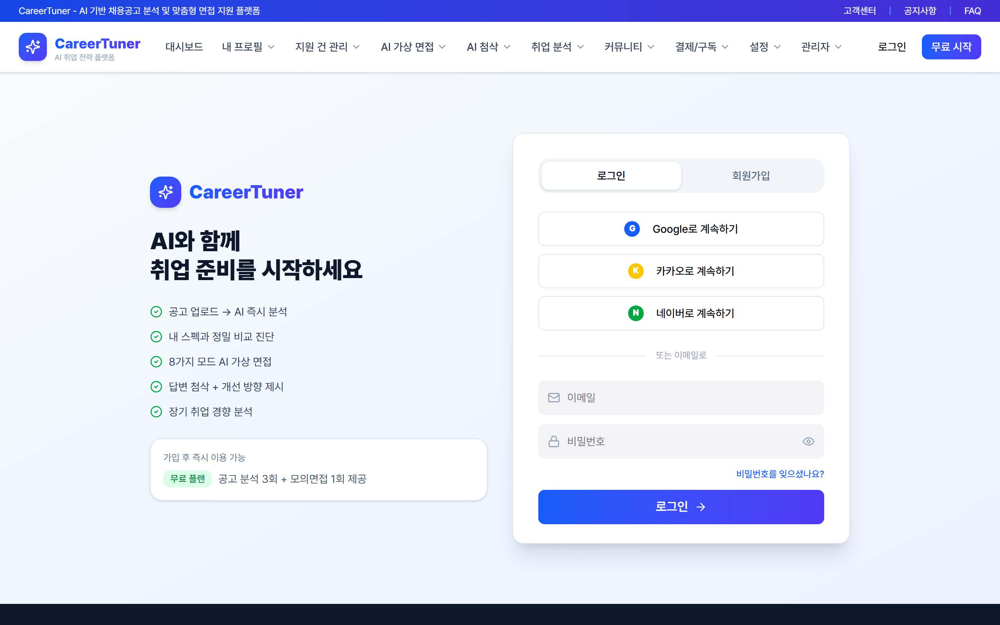
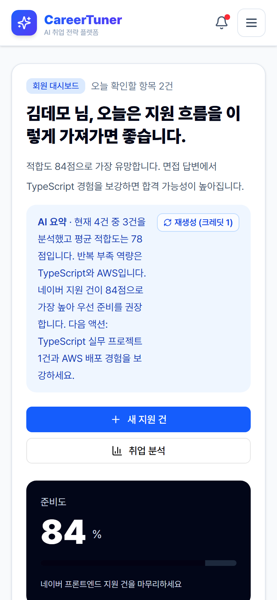

# CareerTuner — 라이브 데모

**CareerTuner**는 채용공고에 맞춰 스펙과 면접 답변을 조정해 주는 AI 취업 전략 플랫폼입니다.
이 저장소는 그 프런트엔드를 **백엔드 없이 체험할 수 있는 데모 빌드**를 GitHub Pages로 서비스합니다.

### ▶ 바로 체험하기 → <https://notetester.github.io/CareerTunerDemo/>
### ▶ 공개 지식맵 → <https://notetester.github.io/CareerTunerDemo/Obsidian/>

## 미리보기

| 홈 | 회원 대시보드 |
| --- | --- |
|  |  |
| **취업 분석** | **로그인** |
|  |  |

  
   
  <em>모바일 화면 — PWA로 설치해 앱처럼 사용할 수 있습니다</em>

## 데모 이용 방법

1. 위 링크로 접속합니다.
2. 로그인 화면에서 **아무 이메일/비밀번호나 입력**하면 데모 계정(김데모)으로 로그인됩니다.
3. 홈 → 대시보드 → 취업 분석 → 적합도 분석 순으로 둘러보세요.

> 모든 데이터는 가상의 목(mock) 데이터이며, 서버 호출 없이 브라우저 안에서만 동작합니다.
> 학습 과제 체크 등 변경 사항은 저장되지 않고 새로고침하면 초기화됩니다.

## 데모에서 볼 수 있는 것

| 영역 | 내용 |
| --- | --- |
| 인증 | 로그인 · 회원가입 흐름 (데모 계정 자동 발급) |
| 홈 / 대시보드 | 지원 현황 · 활동 요약 카드 |
| 취업 분석 | AI 분석 요약과 분석 이력 |
| 적합도 분석 | 공고별 적합도 점수 · 강점/보완점 · 학습 추천 과제(완료 토글 체험 가능) |
| 공개 지식맵 | 프로젝트 구조 · AI/ML 범위 · 배포 산출물 · 공개/비공개 문서 경계 |

아직 데모에 포함되지 않은 화면에서는 *"데모 모드에서는 제공되지 않는 데이터입니다"* 안내가 표시될 수 있습니다.

## PWA 설치

모바일 브라우저에서 **"홈 화면에 추가"**, 데스크톱 Chrome에서는 주소창의 **설치 아이콘**으로
일반 앱처럼 설치해 오프라인 셸과 함께 사용할 수 있습니다.

## 이 저장소에 대하여

- 비공개 소스 저장소에서 GitHub Actions가 **빌드 산출물(정적 파일)만 자동 배포**하는 저장소입니다. 소스 코드는 포함되어 있지 않습니다.
- 배포 때마다 `README.md`, `docs/`, `Obsidian/`을 제외한 모든 파일이 새 빌드로 교체됩니다. 이 저장소로의 직접 기여(이슈/PR)는 받지 않습니다.
- 데모 빌드는 배포 전에 자격증명·내부 주소 등 민감정보 포함 여부를 자동 검사한 뒤 게시됩니다.
